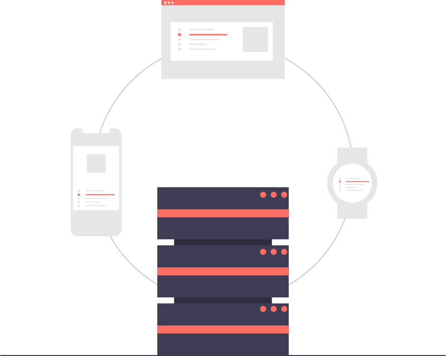

## guacamole-api

    Guacamole backend application for the travel app

  

  #### Simple but complicated guacamole

## Description
This application will be used in a hydroponics farm control system to be used at home with limited space, in greenhouses and indoors as well.

### Application Heroku Links

-   Backend (Swagger Documentation):
    [swagger-documentation](https://almond-api.herokuapp.com/)

-   Frontend (Mobilities App Hosting):
    [mobilities web app](https://almond-re-staging.herokuapp.com/)

-   Postman collection
     
     
    

### Development set up
1. Install [`Node JS`](https://nodejs.org/en/).
2. To clone, run `git clone https://github.com/mashafrancis/almond-be`.
3. `cd` into the root of the **project directory**.
4. `npm install -g yarn`
5. `yarn set version berry && yarn set version latest`
6. `yarn config set nodeLinker "node-modules"`   
   Makes working with existing tools much easier
7. `yarn plugin import typescript`   
   plugin-typescript automatically installs the corresponding @types/foo package for each foo package that you install that doesn't include it's own type definitions. 
8. `yarn plugin import workspace-tools`  https://yarnpkg.com/cli/workspaces/foreach
9. `yarn plugin import exec`   https://yarnpkg.com/cli/exec
10. Run `yarn install` on the terminal to install dependencies.
11. Create a `.env` file in the root directory of the application. Example of the content of a `.env` file is shown in the `.env.example`
12. Install mongodb to your system [`mongodb`](https://docs.mongodb.com/manual/installation/)
13. Install mongodb-tools by running `apt-get mongodb-tools`
14. Install redis server on your machine [`redis install`](https://redis.io/topics/quickstart)
15. Setup local development server.

### Development server

Run `yarn start:dev` for a dev server. Navigate to `http://localhost:8080/`. The app will automatically reload if you change any of the source files.

### Build

Run `yarn build` to build the project. The build artifacts will be stored in the `dist/` directory. Use the `--prod` flag for a production build.

